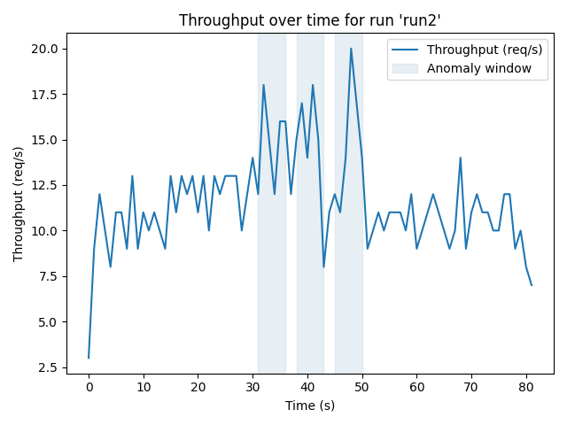

# Distributed Failure Orchestrator & Reliability Analyzer

This project is a small reliability/chaos-engineering tool I built to understand how different distributed systems behave under failure.

It lets you:

- Run **scenario-based load tests** against HTTP and Redis clusters
- **Inject failures** (kill/restart nodes via Docker)
- Collect **per-request metrics** (throughput, latency, errors)
- **Detect anomalies** and estimate recovery time vs a baseline
- Generate **plots** to visualize behavior
- Optionally ask an **LLM (Groq)** to summarize what happened in human language

---

## What this tool does

At a high level:

1. A **Coordinator** reads a YAML scenario (warmup, failure, recovery phases)
2. A **Load Agent** sends requests to a set of HTTP services or Redis nodes
3. A **Control Agent** kills/restarts containers using `docker compose`
4. All requests are logged to CSV in `runs/<run-id>/`
5. An **Analysis module** compares a failure run against a baseline run:
   - throughput change
   - latency shifts
   - error rate
   - anomaly windows
   - recovery time
6. A **Visualization script** plots:
   - throughput over time with shaded anomaly windows
   - baseline vs failure comparison
7. An optional **LLM summary** uses Groq to produce a readable reliability report.

---

## Architecture 

```text
YAML Scenario  ─┐
                │
             Coordinator ──> LoadAgent (HTTP/Redis) ──> Target services
                │
                └─> ControlAgent (docker compose stop/start)

Metrics CSV ──> Analysis ──> JSON summary ──┐
                                           ├─> Plots (PNG)
                                           └─> LLM summary (Markdown)
```

---

## Tech stack
- Python: orchestration, analysis, agents
- Docker Compose: multi-service cluster (HTTP services + Redis nodes)
- Redis: real distributed backend for fault tests
- Pandas: metrics aggregation
- Matplotlib: visualization
- YAML (pyyaml): configuration + scenarios
- Groq: LLM-powered summaries

--- 

## Setup
### Clone the repo
```bash
git clone https://github.com/akhan2133/distributed-orchestrator.git
cd distributed-orchestrator
```

### Create & activate a virtualenv
```bash
python -m venv .venv
source .venv/bin/activate
```

### Install Python dependencies
```bash
pip install -r requirements.txt
```

### Start the Docker services
```bash
docker compose up -d
```

This brings up:
- 3 HTTP service nodes
- a small Redis setup

---

## Configuration (config.yaml)
Most behavior is controlled via config.yaml at the repo root. For example:
```bash
http_nodes:
  - http://localhost:8001
  - http://localhost:8002
  - http://localhost:8003

redis_nodes:
  - redis://localhost:6379
  - redis://localhost:6380

http_services:
  - service-node-1
  - service-node-2
  - service-node-3

redis_services:
  - redis-node-1
  - redis-node-2

anomaly_detection:
  throughput_drop_threshold: 0.5     # 50% drop vs baseline
  error_rate_threshold: 0.1          # 10% error rate
  warmup_ignore_sec: 2               # ignore first 2 seconds as warmup

llm:
  enabled: true
  model: llama-3.3-70b-versatile
  temperature: 0.2
  max_words: 300
```

You can change nodes and thresholds without changing the code.

--- 

## Quick Demo (HTTP Services)

This section shows a concrete example of what happens when you inject a failure into one HTTP node.

### Run a baseline (no failures)
```bash
python -m orchestrator.coordinator \
  --scenario scenarios/baseline_warmup.yaml \
  --run-id http_baseline_demo \
  --mode http
```

This:
- warms up the system with load
- collects metrics
- does not kill any nodes

CSV: runs/http_baseline_demo/metrics.csv

### Run a failure scenario
```bash
python -m orchestrator.coordinator \
  --scenario scenarios/node_failure.yaml \
  --run-id http_run_demo \
  --mode http
```

This scenario:
- warms up with load
- kills one HTTP node during load
- restarts it during the recovery phase

CSV: runs/http_run_demo/metrics.csv

### Analyze the run vs baseline
```bash
python -m orchestrator.analysis \
  --baseline-id http_baseline_demo \
  --run-id http_run_demo \
  > runs/http_run_demo/analysis.json
```

You’ll see JSON like:
```bash
{
  "baseline_id": "http_baseline_20251229_131950",
  "run_id": "http_run_20251229_131950",
  "baseline_summary": {
    "throughput_rps": 10.87,
    "p50_latency_ms": 90.92,
    "p95_latency_ms": 115.91,
    "error_rate": 0.0
  },
  "run_summary": {
    "throughput_rps": 11.34,
    "p50_latency_ms": 90.19,
    "p95_latency_ms": 121.62,
    "error_rate": 0.0779
  },
  "throughput_drop_pct": -4.35,
  "anomaly_windows": [
    { "start_sec": 30, "end_sec": 47 },
    { "start_sec": 49, "end_sec": 50 },
    { "start_sec": 81, "end_sec": 81 }
  ],
  "recovery_time_sec": 51.0
}
```
Interpretation:
- Average throughput doesn’t suffer much (even slightly higher)
- p95 latency gets a bit worse
- error rate jumps to ~7.8% during failure
- anomaly windows capture the disturbance
- recovery time ~ 51 seconds from first to last anomalous second

### Generate plots
```bash
python -m orchestrator.plot_run \
  --run-id run2 \
  --baseline-id baseline2
```

This produces:
- runs/run2/throughput.png
- runs/run2/comparison.png



This plot shows:
- request throughput over time
- shaded bands where anomalies were detected (degraded throughput or elevated errors)
